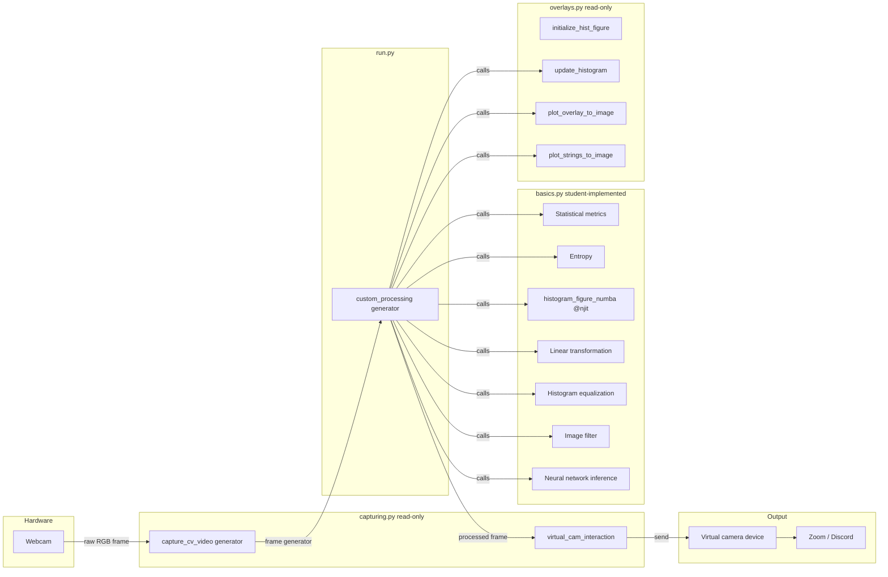

# Design Document: cv-virtual-camera-pipeline

## Overview

This project implements a real-time video processing pipeline for a university Computer Vision course (THI, SS2025). It reads frames from a physical webcam using OpenCV, routes each frame through a sequence of image processing steps implemented in `basics.py`, and forwards the result to a virtual camera device via `pyvirtualcam` so applications like Zoom or Discord can consume the processed stream.

The design follows a **generator-pipeline pattern**: `VirtualCamera.capture_cv_video` is a generator that yields raw frames; `custom_processing` in `run.py` is a generator that wraps the source generator, applies every processing step in order, and yields the final frame; `VirtualCamera.virtual_cam_interaction` drives the loop by consuming frames and feeding them to `pyvirtualcam`.

Key constraints coming from the existing codebase:
- `capturing.py` and `overlays.py` are read-only; all image-processing logic lives in `basics.py`.
- Frames are always `(720, 1280, 3)` RGB `uint8` NumPy arrays.
- The Numba `@njit` decorator is required on `histogram_figure_numba`.
- No additional dependencies beyond `requirements.txt` may be introduced unless they are part of the standard library or already pinned (e.g. `scipy`/`cv2` are available through the existing pins).

---

## Architecture



### Processing Order (per frame, inside `custom_processing`)

1. Compute statistical metrics (mean, mode, std, max, min) per channel → collect for text overlay
2. Compute entropy per channel → collect for text overlay  
3. Apply linear transformation
4. Apply histogram equalization
5. Apply image filter
6. Apply neural-network inference
7. Compute histogram via `histogram_figure_numba`
8. Update histogram figure via `update_histogram`
9. Render histogram overlay via `plot_overlay_to_image`
10. Render text overlay via `plot_strings_to_image` (guarded by dimension check)
11. Toggle histogram overlay via "h" key (debounced)
12. `yield` the final frame

---

## Components and Interfaces

### `basics.py` — Functions to Implement

#### `compute_stats(frame: np.ndarray) -> dict`
Computes mean, mode, standard deviation, maximum, and minimum for each of the three channels.

```python
def compute_stats(frame: np.ndarray) -> dict:
    """
    Returns:
        {
          'mean':  (float, float, float),   # R, G, B
          'mode':  (int,   int,   int),
          'std':   (float, float, float),
          'max':   (int,   int,   int),
          'min':   (int,   int,   int),
        }
    """
```

Each scalar is derived from the intensity histogram / array of the corresponding channel slice `frame[:, :, ch]`.

#### `compute_entropy(frame: np.ndarray) -> tuple[float, float, float]`
Computes Shannon entropy in bits for each channel.

```python
def compute_entropy(frame: np.ndarray) -> tuple:
    """
    Returns: (entropy_r, entropy_g, entropy_b)  — each in [0.0, 8.0]
    """
```

Formula: `H = -sum(p * log2(p))` for non-zero probabilities, where `p` is the normalised histogram of the channel.

#### `histogram_figure_numba(np_img: np.ndarray) -> tuple`
Already declared with `@njit`. Must be completed to fill `r_bars`, `g_bars`, `b_bars` (each length-256 arrays) by iterating over pixels with plain loops (Numba compatible — no OpenCV or Python-object APIs).

```python
@njit
def histogram_figure_numba(np_img):
    """
    Returns: (r_bars, g_bars, b_bars) — each a length-256 1-D array of counts
    """
```

#### `linear_transform(frame: np.ndarray, alpha: float, beta: float) -> np.ndarray`
Applies `output[c] = clip(alpha * input[c] + beta, 0, 255)` independently to each channel.

```python
def linear_transform(frame: np.ndarray, alpha: float, beta: float) -> np.ndarray:
    """
    Args:
        alpha: gain applied to every channel
        beta:  bias applied to every channel
    Returns: transformed frame, dtype uint8, same shape as input
    """
```

#### `histogram_equalization(frame: np.ndarray) -> np.ndarray`
Equalizes each channel independently using the standard CDF-based LUT method.

```python
def histogram_equalization(frame: np.ndarray) -> np.ndarray:
    """
    Returns: equalized frame, dtype uint8, same shape as input
    """
```

#### `apply_filter(frame: np.ndarray) -> np.ndarray`
Applies at least one non-trivial spatial filter (edge detection, blur, sharpen, Sobel, or Gabor). The chosen filter is fixed (not runtime-configurable), but the function must produce a valid `uint8` result of identical spatial dimensions.

```python
def apply_filter(frame: np.ndarray) -> np.ndarray:
    """
    Returns: filtered frame, dtype uint8, same spatial dimensions as input
    """
```

#### `nn_inference(frame: np.ndarray) -> np.ndarray`
Loads a pre-trained model (once, via module-level initialisation) and runs inference on each frame to perform one of: face/object keypoint detection with annotation, region replacement, or semantic segmentation overlay.

```python
def nn_inference(frame: np.ndarray) -> np.ndarray:
    """
    Returns: annotated/modified frame, dtype uint8, same spatial dims as input
    Raises: RuntimeError if model cannot be loaded
    """
```

Model loading happens at module import time (or first call), raising a descriptive `RuntimeError` if the model file is absent.

---

### `run.py` — `custom_processing` Generator

```python
def custom_processing(img_source_generator):
    fig, ax, background, r_plot, g_plot, b_plot = initialize_hist_figure()
    show_histogram = True
    h_key_cooldown = 0

    for frame in img_source_generator:
        # 1–2. Statistics & entropy
        stats = compute_stats(frame)
        ent   = compute_entropy(frame)

        # 3. Linear transform
        frame = linear_transform(frame, alpha=1.0, beta=0.0)

        # 4. Histogram equalization
        frame = histogram_equalization(frame)

        # 5. Filter
        frame = apply_filter(frame)

        # 6. Neural network
        frame = nn_inference(frame)

        # 7–9. Histogram overlay (conditional)
        r_bars, g_bars, b_bars = histogram_figure_numba(frame)
        if show_histogram:
            update_histogram(fig, ax, background, r_plot, g_plot, b_plot,
                             r_bars, g_bars, b_bars)
            frame = plot_overlay_to_image(frame, fig)

        # 10. Text overlay (dimension guard)
        h, w, _ = frame.shape
        if w >= 400 and h >= 70:
            display_text = _build_stats_text(stats, ent)
            frame = plot_strings_to_image(frame, display_text)

        # 11. Toggle histogram with debounce
        if keyboard.is_pressed('h'):
            if h_key_cooldown == 0:
                show_histogram = not show_histogram
                h_key_cooldown = 10
        if h_key_cooldown > 0:
            h_key_cooldown -= 1

        # 12. Yield
        yield frame
```

`_build_stats_text` is a private helper that formats the stats dict into the list of strings expected by `plot_strings_to_image`.

---

## Data Models

### Frame
- Type: `np.ndarray`
- Shape: `(720, 1280, 3)`
- Dtype: `uint8`
- Channel order: RGB (index 0 = Red, 1 = Green, 2 = Blue)
- Value range: `[0, 255]`

### Stats Dictionary
```python
{
    'mean': (float, float, float),   # per-channel mean, [0.0, 255.0]
    'mode': (int,   int,   int),     # per-channel mode, [0, 255]
    'std':  (float, float, float),   # per-channel std,  [0.0, 127.5]
    'max':  (int,   int,   int),     # per-channel max,  [0, 255]
    'min':  (int,   int,   int),     # per-channel min,  [0, 255]
}
```

### Histogram Arrays
- Type: 1-D array-like of length 256 (compatible with `np.ndarray` or Numba typed arrays)
- Dtype: integer counts ≥ 0
- One array per channel: `r_bars`, `g_bars`, `b_bars`

### Pipeline State (inside `custom_processing`)
- `show_histogram: bool` — whether to render the histogram overlay each frame
- `h_key_cooldown: int` — frame counter used to debounce the "h" key toggle (decrement each frame, lock toggle when > 0)

---

## Correctness Properties

*A property is a characteristic or behavior that should hold true across all valid executions of a system — essentially, a formal statement about what the system should do. Properties serve as the bridge between human-readable specifications and machine-verifiable correctness guarantees.*

### Property 1: Statistical metric values are in range

*For any* valid RGB frame, `compute_stats` SHALL return mean, mode, maximum, and minimum values for each channel in the range [0, 255], and standard deviation values in the range [0, 127.5].

Rationale: 1.1–1.5 each require a scalar per channel; 1.6 and 1.7 constrain the ranges. These are all output-invariant checks on the same function call, so one comprehensive property covers them all without redundancy.

**Validates: Requirements 1.1, 1.2, 1.3, 1.4, 1.5, 1.6, 1.7**

---

### Property 2: Uniform frame yields zero standard deviation

*For any* frame where every pixel in each channel has the same constant intensity value, `compute_stats` SHALL return a standard deviation of 0.0 for every channel.

Rationale: Constant-fill frames are a distinct edge case that requires explicit verification beyond range-checking; they are not subsumed by Property 1.

**Validates: Requirements 1.8**

---

### Property 3: Entropy values are in range and are deterministic

*For any* valid RGB frame, `compute_entropy` SHALL return three float values each in [0.0, 8.0], and calling it twice on the same frame SHALL return identical results both times.

Rationale: Range (2.1) and determinism (2.4) are both universal properties that hold across the same input space; they can be verified in a single parameterized run with no loss of coverage.

**Validates: Requirements 2.1, 2.4**

---

### Property 4: Histogram arrays have length 256 and non-negative counts

*For any* valid RGB frame, `histogram_figure_numba` SHALL return exactly three arrays each of length 256, where every element is a non-negative integer.

Rationale: 3.1 (length 256) and 3.2 (non-negative elements) are both checked on the same output tuple in a single call; combining them avoids a redundant loop over the arrays.

**Validates: Requirements 3.1, 3.2**

---

### Property 5: Linear transformation identity

*For any* valid RGB frame, applying `linear_transform` with `alpha=1.0` and `beta=0.0` SHALL return a frame whose pixel values are identical to the input frame.

Rationale: The identity transform is the canonical correctness check for a gain-bias function and is logically independent from the range-clamping property (Property 6).

**Validates: Requirements 5.2**

---

### Property 6: Linear transformation produces valid uint8 output

*For any* valid RGB frame and any finite scalar values for `alpha` and `beta`, `linear_transform` SHALL return a frame of the same shape, dtype `uint8`, and all pixel values clamped to [0, 255].

Rationale: Shape preservation (5.1), dtype preservation (5.1), and clamping (5.3) are all output invariants of the same call; one property covers all three without redundancy.

**Validates: Requirements 5.1, 5.3**

---

### Property 7: Histogram equalization is idempotent

*For any* valid RGB frame, applying `histogram_equalization` twice SHALL return a frame on the second call whose pixel values are identical to the result of the first call.

Rationale: Idempotence (6.4) is a distinct correctness guarantee separate from shape/range; it requires a two-call sequence and is not subsumed by Property 8.

**Validates: Requirements 6.4**

---

### Property 8: Histogram equalization produces valid uint8 output

*For any* valid RGB frame, `histogram_equalization` SHALL return a frame of the same shape, dtype `uint8`, and all pixel values in [0, 255].

Rationale: Shape (6.1), dtype (6.1), and range (6.3) are all output invariants of a single call; combining avoids redundancy while fully covering both requirements.

**Validates: Requirements 6.1, 6.3**

---

### Property 9: Image filter preserves spatial dimensions and produces valid uint8 output

*For any* valid RGB frame, `apply_filter` SHALL return a frame with identical height and width, dtype `uint8`, and all pixel values in [0, 255].

Rationale: Spatial dimension preservation (7.2), dtype (7.3), range (7.3), and clamping (7.4) are all invariants of the same call; one property covers all four without redundancy.

**Validates: Requirements 7.2, 7.3, 7.4**

---

### Property 10: Neural network inference preserves spatial dimensions and produces valid uint8 output

*For any* valid RGB frame for which the model is successfully loaded, `nn_inference` SHALL return a frame with identical height and width, dtype `uint8`, and all pixel values in [0, 255].

Rationale: Spatial dimension preservation (8.3) and valid output format (8.6) are invariants of the same call; one property covers both without redundancy.

**Validates: Requirements 8.3, 8.6**

---

## Error Handling

| Situation | Handling |
|---|---|
| Webcam cannot be opened | `RuntimeError` raised inside `capture_cv_video` (existing code in `capturing.py`) |
| Frame read fails | `RuntimeError` raised inside `capture_cv_video` (existing code in `capturing.py`) |
| Neural network model file missing | `RuntimeError` with descriptive message raised from `nn_inference` at model-load time |
| No face/object/region detected by NN | Return the original frame unmodified (silent pass-through) |
| Frame too small for text overlay | Skip `plot_strings_to_image` call for that frame (guard condition in `custom_processing`) |
| Unhandled exception in `custom_processing` | Let the exception propagate naturally; do not swallow it |
| "q" key pressed | `capture_cv_video` detects it via `keyboard.is_pressed('q')` and terminates the generator with `return` (existing code) |
| "h" key pressed | Toggle `show_histogram` with a debounce counter to avoid rapid re-toggling at high frame rates |

---

## Testing Strategy

### Applicability of Property-Based Testing

This feature is a collection of pure image-processing functions that transform NumPy arrays. Each function has clear typed inputs (frames, scalars) and outputs (frames, scalars, arrays), and its correctness properties hold universally across the entire space of valid `uint8` RGB frames. Property-based testing is therefore well-suited here.

PBT is **not** applied to:
- `histogram_figure_numba` integration with `update_histogram`/`plot_overlay_to_image` — these involve Matplotlib figure state and side effects; an example-based integration test is more appropriate.
- The virtual camera output path — this requires `pyvirtualcam` hardware/driver; tested manually or with mocks.
- `nn_inference` model-load error path — a single example-based test is sufficient.

### Property-Based Testing Library

**`hypothesis`** (Python) — widely used, supports NumPy strategies via `hypothesis[numpy]`.

Each property test runs a minimum of **100 iterations** (Hypothesis default is ≥ 100 examples per test). Each test is tagged with a comment of the form:

```python
# Feature: cv-virtual-camera-pipeline, Property N: <property_text>
```

### Unit Tests (Example-Based)

The following scenarios are covered by concrete example tests:

- **Requirement 1.1–1.5**: Known constant frames → verify exact mean/mode/std/max/min values.
- **Requirement 2.2**: Single-intensity channel → entropy == 0.0.
- **Requirement 2.3**: Perfectly uniform histogram → entropy == 8.0.
- **Requirement 3.3**: Verify `@njit` decorator is present on `histogram_figure_numba`.
- **Requirement 3.4**: Frame where all Red pixels == 128 → `r_bars[128]` is the only non-zero element.
- **Requirement 3.5**: Integration smoke test — `custom_processing` calls `update_histogram` each cycle (mock-based).
- **Requirement 4.1–4.3**: Integration smoke test — `plot_overlay_to_image` called with correct figure.
- **Requirement 8.4**: Model file absent → `RuntimeError` raised with descriptive message.
- **Requirement 8.5**: Frame with no detectable content → returned frame equals input frame.
- **Requirement 9.1–9.3**: Text overlay strings contain R/G/B labels and min/max/mean/std values.
- **Requirement 10.3**: "q" key causes generator to stop cleanly (mock keyboard).
- **Requirement 10.4**: "h" key toggles histogram on/off with debounce.
- **Requirement 10.5**: Processing functions called exactly once per frame in the defined order.
- **Requirement 10.6**: Exception raised inside loop propagates out of `custom_processing`.

### Test File Layout

```
tests/
  test_stats.py          # Properties 1–2, example tests for Req 1
  test_entropy.py        # Properties 3–4, example tests for Req 2
  test_histogram.py      # Property 5, example tests for Req 3
  test_linear.py         # Properties 6–7, example tests for Req 5
  test_equalization.py   # Properties 8–9, example tests for Req 6
  test_filter.py         # Property 10, example tests for Req 7
  test_nn.py             # Property 11, example tests for Req 8
  test_pipeline.py       # Integration / smoke tests for Req 4, 9, 10
```
